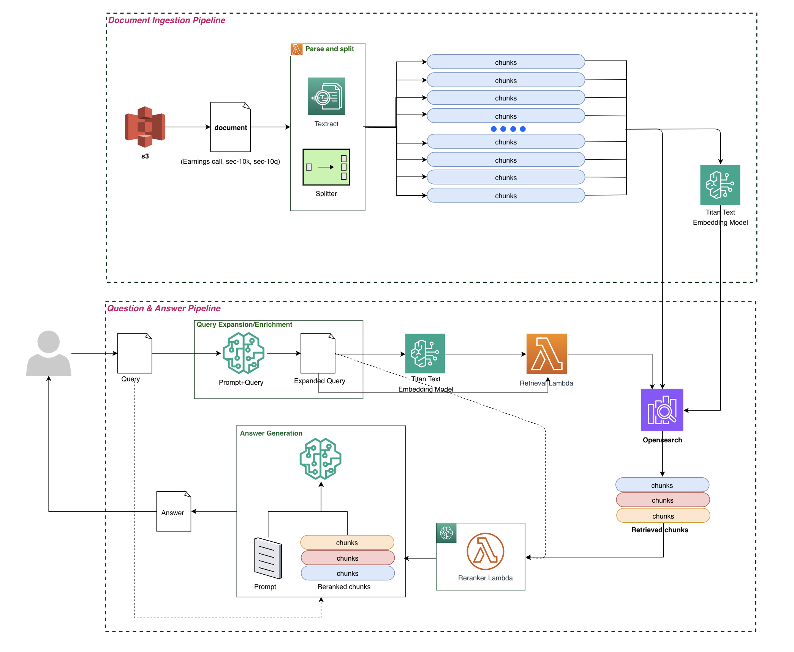

# RAG based QnA - Investment Analyst Assistant

### Table of Contents
1. [Overview](#overview) 
2. [Solution Advantages](#solution-advantages)
3. [Architecture](#architecture)
4. [Set up and Instructions](#set-up-and-instructions)
5. [Common Issues](#common-issues)
6. [License](#license)
7. [Contact Information](#contact-information)
8. [Security](#security)


## Overview
In this repo, we will conduct migration for a use case of RAG-based question answering. We will use an AWS in-house RAG solution named "Investment Analyst Assistant" (IAA) developed by AWS GenAIIC team for Financial Document Understanding and Question-Answering.
This series of Jupyter Notebooks demonstrates how to build an intelligent Investment Analyst Assistant using natural language processing techniques. We'll work with financial documents to create a question-answering system that provides reliable answers.The notebooks cover:
* 01_Indexing Pipeline Notebook: Preprocess documents, create chunks, generate embeddings, and upload to OpenSearch Serverless.
* 02_Query-rewrite_Retrieval_and_Generation_Notebook_OpenAI: Rewrite queries, retrieve chunks, extract metadata, and generate answers using OpenAI's language model and raw prompts.
* 03_Prompt_migration_Metaprompt: Migrate raw prompts to XML-based prompts compatible with Anthropic's Claude.
* 04_Query-rewrite_Retrieval_and_Generation_Notebook_Claude3: Leverage migrated prompts for query rewriting, chunk retrieval, metadata extraction, and answer generation using Claude 3.
* 05a_Evaluate_QnA_DeepEval: Evaluate performance using DeepEval.
* 05b_Evaluate_QnA_RAGAS: Evaluate performance using RAGAS.

## Solution Advantages
By the end, you'll understand:  
* how to build a RAF question and answer capable of providing accurate answers from financial documents, using the latest NLP techniques like prompt engineering, query rewriting, and performance evaluation.  
* how to Migrate raw prompts to claude XML based prompts  
* how to evaluate questions and answers using DeepEval and RAGAS.

<u>IAA is configured for financial use cases. However, it enables indexing any PDF documents.</u>

## Architecture
This architecture leverages state-of-the-art natural language processing techniques, including text embedding, prompt engineering, and retrieval from a vector database, to provide accurate and relevant answers to queries based on financial documents. 
The architecture consists of two main pipelines: the Document Ingestion Pipeline and the Question & Answer Pipeline.
In the Document Ingestion pipeline:
1. Financial documents (e.g., earnings calls, SEC filings) are ingested.
2. The documents are parsed and split into chunks using the Textract and Splitter components.
3. The chunks are then passed to the Titan Text Embedding Model, which generates embeddings for each chunk.

In the Question & Answer pipeline:
1. A user provides a query.
2. The Query Expansion/Enrichment module uses prompt engineering techniques to expand and enrich the query.
3. The expanded query embeddings are generated using the Titan Text Embedding Model.
4. The Retrieval component retrieves relevant chunks from the OpenSearch instance based on the query embeddings.
5. The retrieved chunks are passed to the Answer Generation module, which involves prompt engineering and interaction with a language model (OpenAI or Claude) to generate the final answer.


<!-- <center>

</center> -->


## Set up and Instructions
To get started with the code examples, ensure you have access to Amazon SageMaker and S3. 

### Access to Bedrock Models
Make sure you have access to the following bedrock models
* amazon.titan-embed-text-v1 (Titan Embeddings G1 - Text)
* anthropic.claude-3-haiku-20240307-v1:0 (Anthropic Claude 3 Haiku)
* mistral.mistral-large-2402-v1:0 (Mistral Large(24.02))

### Permissions for Notebook Role
Make sure the sagemaker has following permission
* AmazonOpenSearchServiceFullAccess
* AmazonSageMakerFullAccess
* AmazonTextractFullAccess
* Add following in line policy

```
{
    "Version": "2012-10-17",
    "Statement": [
        {
            "Effect": "Allow",
            "Action": [
                "s3:GetObject",
                "s3:PutObject",
                "s3:DeleteObject",
                "s3:ListBucket"
            ],
            "Resource": [
                "arn:aws:s3:::*"
            ]
        },
        {
            "Effect": "Allow",
            "Action": [
                "aoss:*"
            ],
            "Resource": [
                "*"
            ]
        },
        {
            "Effect": "Allow",
            "Action": [
                "bedrock:InvokeModel",
                "bedrock:InvokeModelWithResponseStream"
            ],
            "Resource": [
                "*"
            ]
        }
    ]
}
```
Note: This permission shall be used only for the local experimentation. NOT for production.

> ⚠️ **Note:** With Amazon SageMaker, your notebook execution role will typically be *separate* from the user or role that you log in to the AWS Console with. If you'd like to explore the AWS Console for Amazon Bedrock, you'll need to grant permissions to your Console user/role too.

For more information on the fine-grained action and resource permissions in Bedrock, check out the Bedrock Developer Guide.

## Common Issues
* Warnings and in some case, version errors can be ignored for package installation. Those are due to version updates. Only change versions if necessary.

## License
This library is licensed under the MIT-0 License. See the [LICENSE](LICENSE) file.

## Contact Information
We welcome community contributions! Please see [CONTRIBUTING.md](CONTRIBUTING.md) for guidelines.

## Security
See [CONTRIBUTING](CONTRIBUTING.md#security-issue-notifications) for more information.


